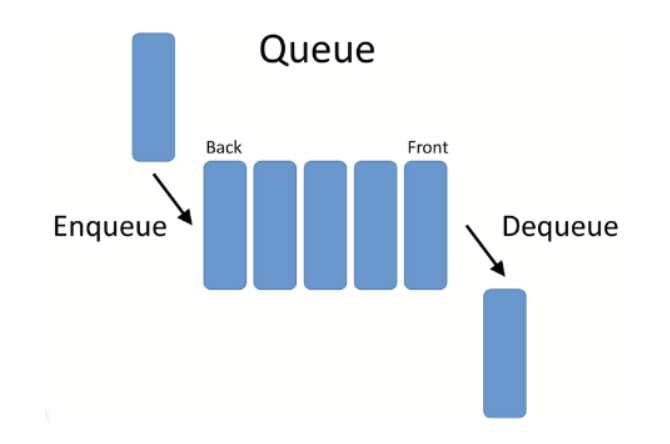

## Queues

A queue is a linear data structure that follows the First-In-First-Out (FIFO) principle. It's similar to a real-world queue or line of people waiting for something, where the person who arrives first is the one who gets served first.

In a queue, elements are added at one end (called the "rear" or "tail") and removed from the other end (called the "front" or "head"). This ensures that the element that has been in the queue the longest is the first one to be removed.

## Key characteristics of a queue:

1.    Enqueue: Adding an element to the rear of the queue.
2.    Dequeue: Removing an element from the front of the queue.
3.    Front: Getting the element at the front of the queue without removing it.
4.    Rear: Getting the element at the rear of the queue without removing it.
5.    IsEmpty: Checking if the queue is empty.
6.    Size: Finding the number of elements in the queue.