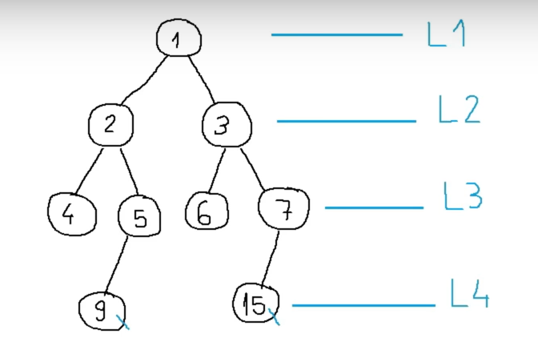
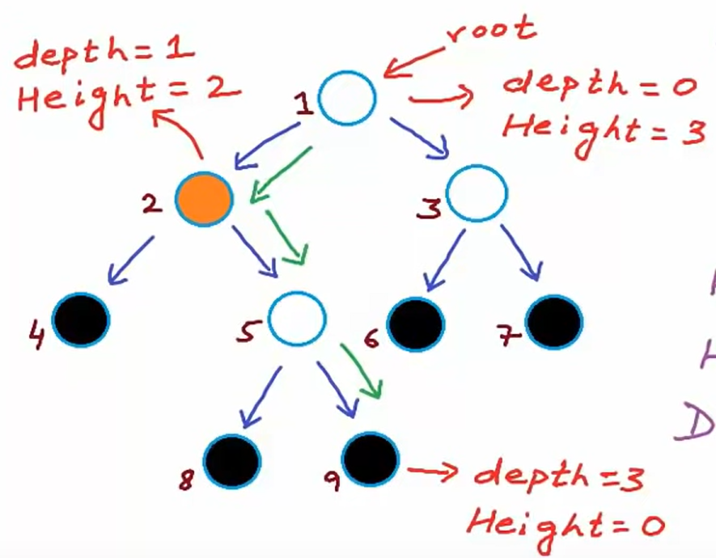

## 1. Trees
 Trees are abstract data structure that resembles a hierarchial structure or a tree like arrangements of elements. Trees are composed of nodes, where each node typically has zero or more child nodes, except for the root node, which has no parent.

## 2. Binary Tree
 A binary tree is a tree data structure in which each node can have at most two children, which are referred to as the left child and the right child.

## 3. Binary Search Tree
 In a BST, the values are organized in such a way that the left child of a node contains values less than the parent node, and the right child contains values greater than the parent node. Basically it is efficient for different operations.

## 4. create-binary-tree.cpp

## 5. Traversing through a Tree
Two main algorithms to traverse through a tree: 
- DFS (Depth First Search): prioritizes depth search over breadth.
    - pre-order (data, left, right)
    - in-order (left, data, right)
    - post-order (left, right, data)

- BFS (Breadth First Search): prioritizes breadth search over depth.

## 6. Height and Depth of a binary tree

Height of the node is the longest path from the node to a leaf node.
ALSO! height of the tree = height of the node
Height of the tree with 1 node = 0

Depth of the node is the number of the edges from root to that node

